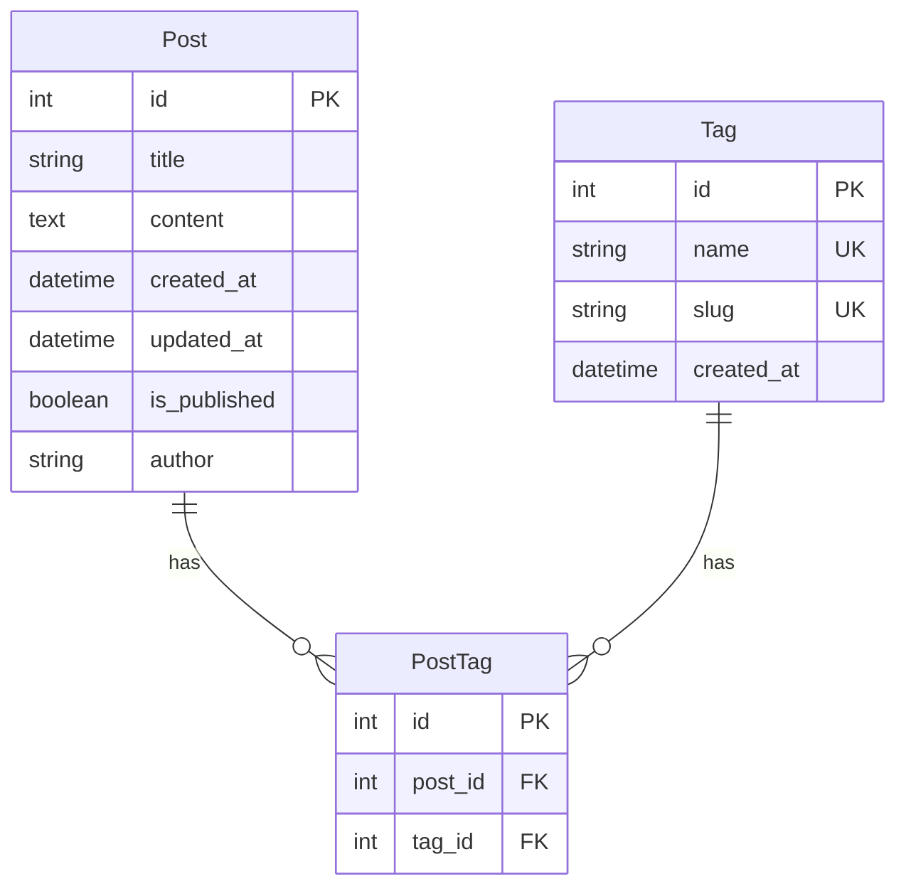

# Django 블로그 애플리케이션 ERD

## Entity Relationship Diagram (Mermaid)



## 테이블 설명

### Post (게시글)
- **id**: 기본키 (Primary Key)
- **title**: 게시글 제목 (최대 200자)
- **content**: 게시글 본문 (텍스트)
- **created_at**: 작성일시 (자동 생성)
- **updated_at**: 수정일시 (자동 업데이트)
- **is_published**: 게시 여부 (True/False)
- **author**: 작성자명 (선택 사항)

### Tag (태그)
- **id**: 기본키 (Primary Key)
- **name**: 태그 이름 (Unique, 예: "Python", "Django")
- **slug**: URL 친화적 이름 (Unique, 예: "python", "django")
- **created_at**: 생성일시 (자동 생성)

### PostTag (게시글-태그 연결 테이블)
- **id**: 기본키 (Primary Key)
- **post_id**: Post 테이블의 외래키 (Foreign Key)
- **tag_id**: Tag 테이블의 외래키 (Foreign Key)

## 관계 설명

- **Post ↔ Tag**: 다대다(N:M) 관계
  - 하나의 게시글은 여러 개의 태그를 가질 수 있습니다.
  - 하나의 태그는 여러 게시글에 사용될 수 있습니다.
  - Django의 ManyToManyField를 사용하여 구현합니다.

## Django 모델 구현 예시

```python
# main/models.py
from django.db import models
from django.utils.text import slugify

class Tag(models.Model):
    name = models.CharField(max_length=50, unique=True)
    slug = models.SlugField(max_length=50, unique=True)
    created_at = models.DateTimeField(auto_now_add=True)

    def save(self, *args, **kwargs):
        if not self.slug:
            self.slug = slugify(self.name)
        super().save(*args, **kwargs)

    def __str__(self):
        return self.name

class Post(models.Model):
    title = models.CharField(max_length=200)
    content = models.TextField()
    created_at = models.DateTimeField(auto_now_add=True)
    updated_at = models.DateTimeField(auto_now=True)
    is_published = models.BooleanField(default=False)
    author = models.CharField(max_length=100, blank=True, null=True)
    tags = models.ManyToManyField(Tag, related_name='posts', blank=True)

    def __str__(self):
        return self.title

    class Meta:
        ordering = ['-created_at']
```

## 다음 단계

1. `main/models.py`에 위 모델 코드 작성
2. `python manage.py makemigrations` 실행
3. `python manage.py migrate` 실행
4. `main/admin.py`에 모델 등록
5. 관리자 계정 생성: `python manage.py createsuperuser`
6. views.py 수정하여 실제 데이터 표시
