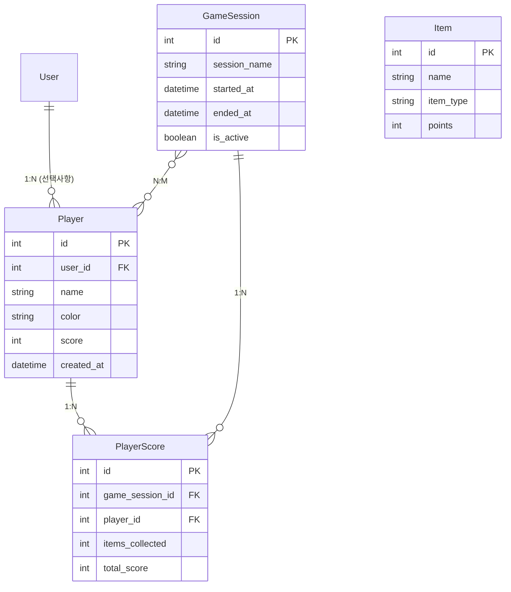
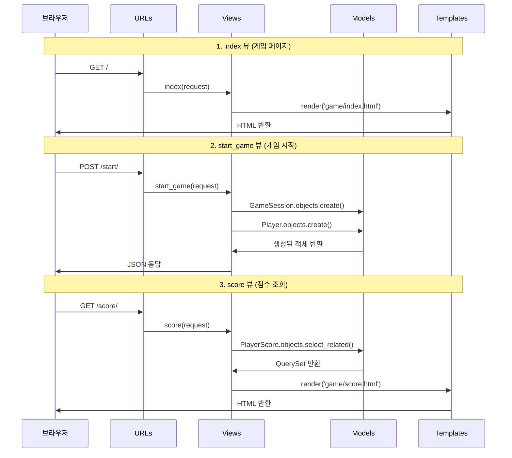
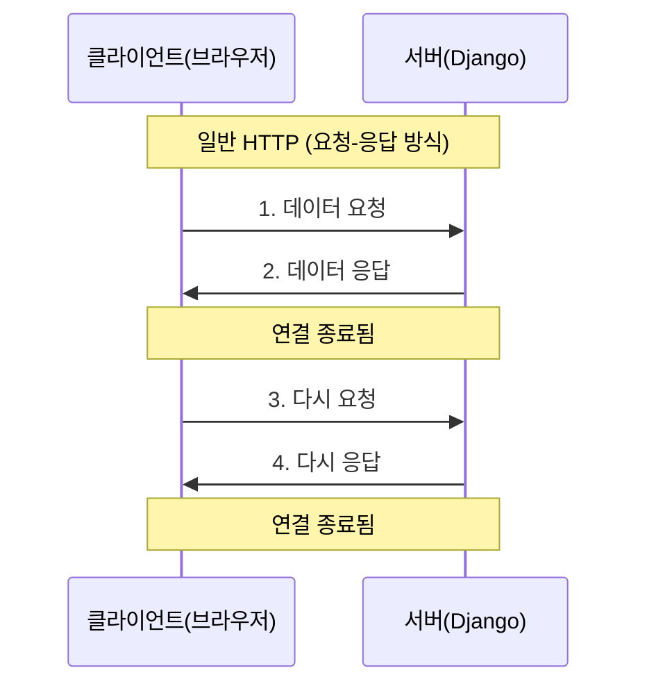
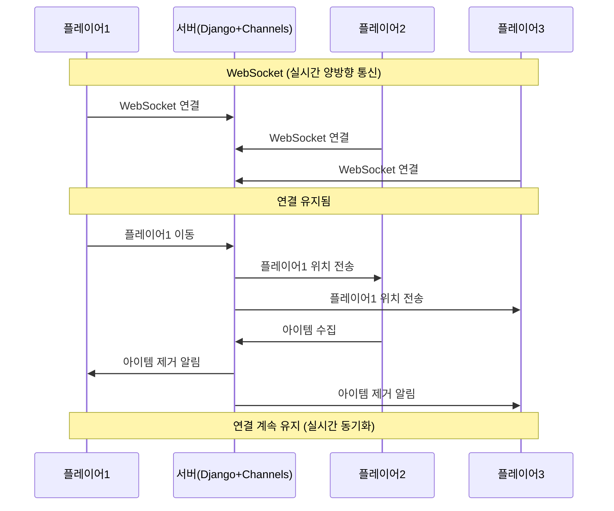
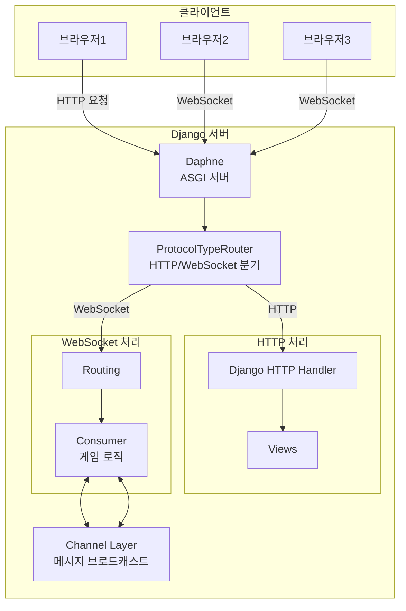
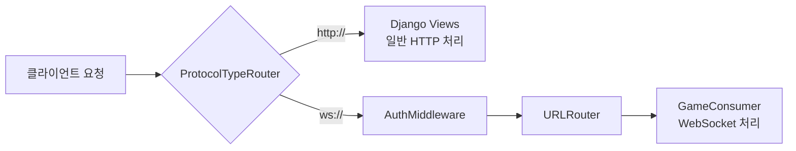
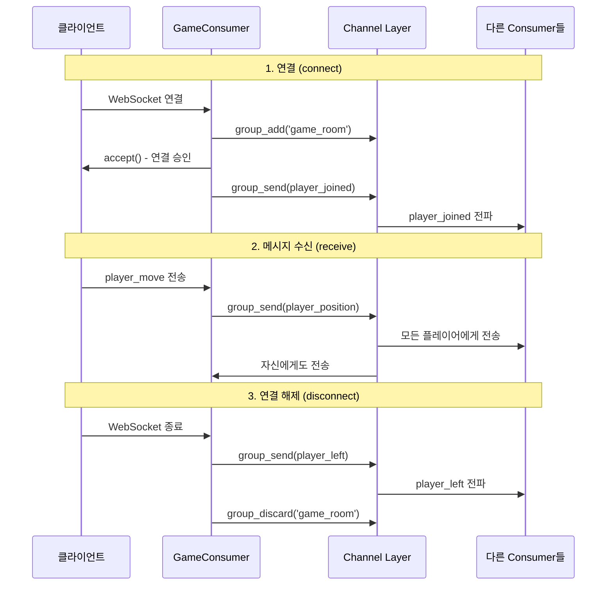

# Three.js 요리 아이템 수집 게임 구축 가이드

## 게임 개요
Overcooked 스타일의 요리 아이템 수집 게임을 Three.js와 Django를 사용하여 구현합니다.
- 플레이어: 3명
- 목표: 요리사가 맵에서 요리 아이템을 수집

## 프로젝트 구조
```
game/
├── static/
│   ├── js/
│   │   ├── game.js          # 메인 게임 로직
│   │   ├── player.js        # 플레이어 클래스
│   │   ├── item.js          # 아이템 클래스
│   │   └── map.js           # 맵 생성
│   ├── css/
│   │   └── style.css        # 게임 스타일
│   └── models/              # 3D 모델 (선택사항)
├── templates/
│   └── game/
│       └── index.html       # 게임 메인 페이지
└── requirements.txt
```

---

## 초기 세팅 (Windows)

### 1. 가상환경 생성 및 Django 설치
```bash
python -m venv venv
.\venv\Scripts\activate
pip install django
django-admin startproject config .
```

### 2. 게임 앱 생성
```bash
python manage.py startapp game
```

### 3. settings.py 설정
```python
# config/settings.py
ALLOWED_HOSTS = ["*"]

INSTALLED_APPS = [
    'django.contrib.admin',
    'django.contrib.auth',
    'django.contrib.contenttypes',
    'django.contrib.sessions',
    'django.contrib.messages',
    'django.contrib.staticfiles',
    'game',  # 추가
]

# Static 파일 설정
STATIC_URL = '/static/'
STATICFILES_DIRS = [
    BASE_DIR / 'static',
]
```

### 4. 데이터베이스 마이그레이션
```bash
python manage.py migrate
```

---

## 데이터베이스 모델 설계

**모델 관계도:**


### 5. 모델 작성
```python
# game/models.py
from django.db import models
from django.contrib.auth.models import User

# 플레이어 모델: 게임 참가자 정보
class Player(models.Model):
    # ForeignKey: User와 1:N 관계 (한 명의 유저가 여러 플레이어 생성 가능)
    # on_delete=CASCADE: User 삭제 시 관련 Player도 삭제
    # null=True, blank=True: User 없이도 Player 생성 가능 (게스트 플레이어)
    user = models.ForeignKey(User, on_delete=models.CASCADE, null=True, blank=True)

    # 플레이어 이름 (최대 50자)
    name = models.CharField(max_length=50)

    # 플레이어 색상 (게임에서 캐릭터 구분용)
    color = models.CharField(max_length=20, default='red')

    # 총 점수
    score = models.IntegerField(default=0)

    # 생성 시간 (auto_now_add: 생성 시 자동으로 현재 시간 저장)
    created_at = models.DateTimeField(auto_now_add=True)

    def __str__(self):
        return self.name  # Admin 페이지에서 보이는 이름

# 아이템 모델: 수집할 요리 재료
class Item(models.Model):
    # choices: 드롭다운에서 선택할 수 있는 옵션들
    ITEM_TYPES = [
        ('tomato', '토마토'),
        ('lettuce', '양상추'),
        ('cheese', '치즈'),
        ('bread', '빵'),
        ('meat', '고기'),
    ]

    # 아이템 이름
    name = models.CharField(max_length=50)

    # 아이템 타입 (ITEM_TYPES에서 선택)
    item_type = models.CharField(max_length=20, choices=ITEM_TYPES)

    # 아이템 점수 (수집 시 얻는 점수)
    points = models.IntegerField(default=10)

    def __str__(self):
        return self.name

# 게임 세션 모델: 한 판의 게임
class GameSession(models.Model):
    # 게임 세션 이름
    session_name = models.CharField(max_length=100)

    # ManyToManyField: Player와 N:M 관계
    # 한 게임에 여러 플레이어, 한 플레이어가 여러 게임 참여 가능
    # related_name: Player에서 역참조 시 사용 (player.game_sessions.all())
    players = models.ManyToManyField(Player, related_name='game_sessions')

    # 게임 시작 시간
    started_at = models.DateTimeField(auto_now_add=True)

    # 게임 종료 시간 (null 허용: 진행 중이면 None)
    ended_at = models.DateTimeField(null=True, blank=True)

    # 게임 진행 중 여부
    is_active = models.BooleanField(default=True)

    def __str__(self):
        return self.session_name

# 플레이어 점수 모델: 특정 게임에서 특정 플레이어의 점수
class PlayerScore(models.Model):
    # ForeignKey: GameSession과 1:N 관계
    game_session = models.ForeignKey(GameSession, on_delete=models.CASCADE)

    # ForeignKey: Player와 1:N 관계
    player = models.ForeignKey(Player, on_delete=models.CASCADE)

    # 수집한 아이템 개수
    items_collected = models.IntegerField(default=0)

    # 총 점수
    total_score = models.IntegerField(default=0)

    class Meta:
        # unique_together: (game_session, player) 조합이 유일해야 함
        # = 한 게임에서 같은 플레이어는 한 번만 등록 가능
        unique_together = ['game_session', 'player']

    def __str__(self):
        return f"{self.player.name} - {self.total_score}"
```

### 6. 모델 마이그레이션
```bash
python manage.py makemigrations
python manage.py migrate
```

### 7. admin 등록
```python
# game/admin.py
from django.contrib import admin
from .models import Player, Item, GameSession, PlayerScore

admin.site.register(Player)
admin.site.register(Item)
admin.site.register(GameSession)
admin.site.register(PlayerScore)
```

### 8. 관리자 계정 생성
```bash
python manage.py createsuperuser
# 사용자명, 이메일, 비밀번호 입력
```

---

## URL 및 View 설정

### 9. URL 설계
```
'/' : 게임 메인 페이지
'/game/start' : 게임 시작
'/game/score' : 점수 확인
'/admin' : 관리자 페이지
```

### 10. 프로젝트 URL 설정
```python
# config/urls.py
from django.contrib import admin
from django.urls import path, include

urlpatterns = [
    path("admin/", admin.site.urls),
    path("", include("game.urls")),
]
```

### 11. game 앱 URL 설정
```python
# game/urls.py (새로 생성)
from django.urls import path
from . import views

# app_name: URL 네임스페이스 (템플릿에서  형태로 사용)
app_name = 'game'

urlpatterns = [
    # '/' → index 뷰 함수 호출
    path("", views.index, name="index"),

    # '/start/' → start_game 뷰 함수 호출
    path("start/", views.start_game, name="start_game"),

    # '/score/' → score 뷰 함수 호출
    path("score/", views.score, name="score"),
]
```

### 12. View 함수 작성
```python
# game/views.py
from django.shortcuts import render
from django.http import JsonResponse
from .models import Player, Item, GameSession, PlayerScore

# 게임 메인 페이지
def index(request):
    """
    게임 메인 페이지를 렌더링
    - GET 요청만 처리
    - templates/game/index.html 반환
    """
    return render(request, 'game/index.html')

# 게임 시작 API (사용하지 않을 수도 있음)
def start_game(request):
    """
    게임 세션 생성 및 플레이어 등록
    - POST 요청만 처리
    - JSON 형태로 세션 정보 반환
    """
    # POST 요청인지 확인
    if request.method == 'POST':
        # 새 게임 세션 생성
        session = GameSession.objects.create(session_name="New Game")

        # 3명의 플레이어 생성
        players = []
        colors = ['red', 'blue', 'green']

        # enumerate: 인덱스와 값을 동시에 반환
        for i, color in enumerate(colors):
            # Player 객체 생성 및 DB 저장
            player = Player.objects.create(
                name=f"Player {i+1}",
                color=color
            )

            # ManyToMany 관계 추가
            session.players.add(player)

            # 응답 데이터 준비
            players.append({
                'id': player.id,
                'name': player.name,
                'color': player.color
            })

        # JSON 응답 반환
        return JsonResponse({
            'session_id': session.id,
            'players': players
        })

    # POST가 아닌 경우 에러 반환
    return JsonResponse({'error': 'Invalid request'}, status=400)

# 점수 확인 페이지
def score(request):
    """
    전체 게임 점수 순위 표시
    - select_related: JOIN 쿼리로 성능 최적화
    - order_by('-total_score'): 점수 높은 순으로 정렬
    """
    # PlayerScore와 연관된 Player, GameSession을 한 번에 조회 (JOIN)
    scores = PlayerScore.objects.select_related(
        'player',
        'game_session'
    ).order_by('-total_score')  # 점수 내림차순

    # templates/game/score.html에 scores 전달
    return render(request, 'game/score.html', {'scores': scores})
```

**View 함수 요청/응답 흐름:**


---

## 프론트엔드 구현 (Three.js)

### 13. HTML 템플릿 생성
```html
<!-- templates/game/index.html -->
<!DOCTYPE html>
<html lang="ko">
<head>
    <meta charset="UTF-8">
    <meta name="viewport" content="width=device-width, initial-scale=1.0">
    <title>요리 아이템 수집 게임</title>
    <style>
        body { margin: 0; overflow: hidden; }
        canvas { display: block; }
        #info {
            position: absolute;
            top: 10px;
            left: 10px;
            color: white;
            font-family: Arial;
            background: rgba(0,0,0,0.5);
            padding: 10px;
            border-radius: 5px;
        }
    </style>
</head>
<body>
    <div id="info">
        <h2>요리 아이템 수집 게임</h2>
        <p>이동: WASD / 화살표 키</p>
        <p>점수: <span id="score">0</span></p>
    </div>

    <script src="https://cdnjs.cloudflare.com/ajax/libs/three.js/r128/three.min.js"></script>
    <script>
        // Three.js 기본 설정
        const scene = new THREE.Scene();
        const camera = new THREE.PerspectiveCamera(75, window.innerWidth / window.innerHeight, 0.1, 1000);
        const renderer = new THREE.WebGLRenderer();

        renderer.setSize(window.innerWidth, window.innerHeight);
        document.body.appendChild(renderer.domElement);

        // 조명 추가
        const light = new THREE.DirectionalLight(0xffffff, 1);
        light.position.set(5, 10, 5);
        scene.add(light);
        scene.add(new THREE.AmbientLight(0x404040));

        // 바닥 생성
        const floorGeometry = new THREE.PlaneGeometry(20, 20);
        const floorMaterial = new THREE.MeshStandardMaterial({ color: 0x808080 });
        const floor = new THREE.Mesh(floorGeometry, floorMaterial);
        floor.rotation.x = -Math.PI / 2;
        scene.add(floor);

        // 플레이어 생성 (3명)
        const players = [];
        const playerColors = [0xff0000, 0x0000ff, 0x00ff00];
        const playerPositions = [
            { x: -5, z: 0 },
            { x: 0, z: 0 },
            { x: 5, z: 0 }
        ];

        playerPositions.forEach((pos, index) => {
            const geometry = new THREE.BoxGeometry(1, 1, 1);
            const material = new THREE.MeshStandardMaterial({ color: playerColors[index] });
            const player = new THREE.Mesh(geometry, material);
            player.position.set(pos.x, 0.5, pos.z);
            scene.add(player);
            players.push(player);
        });

        // 아이템 생성
        const items = [];
        function createItem() {
            const geometry = new THREE.SphereGeometry(0.3, 16, 16);
            const material = new THREE.MeshStandardMaterial({ color: 0xffff00 });
            const item = new THREE.Mesh(geometry, material);
            item.position.set(
                Math.random() * 18 - 9,
                0.3,
                Math.random() * 18 - 9
            );
            scene.add(item);
            items.push(item);
        }

        // 초기 아이템 10개 생성
        for (let i = 0; i < 10; i++) {
            createItem();
        }

        // 카메라 위치
        camera.position.set(0, 15, 15);
        camera.lookAt(0, 0, 0);

        // 키보드 입력
        const keys = {};
        document.addEventListener('keydown', (e) => keys[e.key] = true);
        document.addEventListener('keyup', (e) => keys[e.key] = false);

        let score = 0;
        const currentPlayer = players[0]; // 기본 플레이어

        // 게임 루프
        function animate() {
            requestAnimationFrame(animate);

            // 플레이어 이동
            const speed = 0.1;
            if (keys['w'] || keys['ArrowUp']) currentPlayer.position.z -= speed;
            if (keys['s'] || keys['ArrowDown']) currentPlayer.position.z += speed;
            if (keys['a'] || keys['ArrowLeft']) currentPlayer.position.x -= speed;
            if (keys['d'] || keys['ArrowRight']) currentPlayer.position.x += speed;

            // 경계 체크
            currentPlayer.position.x = Math.max(-9.5, Math.min(9.5, currentPlayer.position.x));
            currentPlayer.position.z = Math.max(-9.5, Math.min(9.5, currentPlayer.position.z));

            // 아이템 충돌 감지
            items.forEach((item, index) => {
                const distance = currentPlayer.position.distanceTo(item.position);
                if (distance < 1) {
                    scene.remove(item);
                    items.splice(index, 1);
                    score += 10;
                    document.getElementById('score').textContent = score;
                    createItem(); // 새 아이템 생성
                }
            });

            renderer.render(scene, camera);
        }

        animate();

        // 화면 크기 변경 대응
        window.addEventListener('resize', () => {
            camera.aspect = window.innerWidth / window.innerHeight;
            camera.updateProjectionMatrix();
            renderer.setSize(window.innerWidth, window.innerHeight);
        });
    </script>
</body>
</html>
```

---

## 서버 실행 및 테스트

### 14. 서버 실행
```bash
python manage.py runserver
```

### 15. 접속 URL
- http://127.0.0.1:8000/ : 게임 메인 페이지
- http://127.0.0.1:8000/admin : 관리자 페이지
- http://127.0.0.1:8000/game/score : 점수 확인

---

## 실시간 멀티플레이어 기능 구현 (WebSocket)

### WebSocket과 Django Channels 개념

**일반 HTTP vs WebSocket 비교:**




**Django Channels 아키텍처:**


### 16. Django Channels 설치
```bash
# channels: Django에 WebSocket 지원 추가
pip install channels

# daphne: ASGI 서버 (WSGI 대신 사용)
# WSGI = 일반 HTTP만 처리
# ASGI = HTTP + WebSocket 모두 처리
pip install daphne
```

### 17. settings.py 수정 - Channels 설정
```python
# config/settings.py

# 모든 호스트에서 접속 허용 (개발용)
ALLOWED_HOSTS = ["*"]

INSTALLED_APPS = [
    'daphne',  # 최상단에 추가 (중요!)
                # daphne이 runserver 명령어를 대체하여 ASGI 서버로 실행
    'django.contrib.admin',
    'django.contrib.auth',
    'django.contrib.contenttypes',
    'django.contrib.sessions',
    'django.contrib.messages',
    'django.contrib.staticfiles',
    'game',  # 우리가 만든 게임 앱
]

# ASGI 애플리케이션 지정
# 기존: WSGI_APPLICATION (HTTP만 처리)
# 변경: ASGI_APPLICATION (HTTP + WebSocket 처리)
ASGI_APPLICATION = 'config.asgi.application'

# Channel Layer 설정 (메시지 브로드캐스트 담당)
# InMemoryChannelLayer: 메모리에 저장 (개발용)
# 실제 배포 시에는 Redis를 사용 (channels-redis)
CHANNEL_LAYERS = {
    'default': {
        'BACKEND': 'channels.layers.InMemoryChannelLayer'
    }
}
```

**Channel Layer란?**
- 여러 Consumer 인스턴스 간에 메시지를 전달하는 시스템
- 예: 플레이어1이 움직이면 → Channel Layer → 플레이어2, 3에게 전송

### 18. ASGI 라우팅 설정 (중요!)
```python
# config/asgi.py (전체 수정)
import os
from django.core.asgi import get_asgi_application
from channels.routing import ProtocolTypeRouter, URLRouter
from channels.auth import AuthMiddlewareStack
from game import routing

# Django settings 모듈 지정
os.environ.setdefault('DJANGO_SETTINGS_MODULE', 'config.settings')

# 중요: Django ASGI application을 먼저 초기화해야 합니다!
# settings.py를 먼저 로드하고 Django를 초기화
django_asgi_app = get_asgi_application()

# ProtocolTypeRouter: 프로토콜 타입에 따라 요청을 분기
# - "http" 요청 → Django의 일반 뷰로 전달
# - "websocket" 요청 → Channels의 Consumer로 전달
application = ProtocolTypeRouter({
    "http": django_asgi_app,  # HTTP 요청 처리 (기존 Django views)
    "websocket": AuthMiddlewareStack(  # 인증 미들웨어 적용
        URLRouter(  # URL 패턴에 따라 Consumer 연결
            routing.websocket_urlpatterns  # game/routing.py의 WebSocket URL 패턴
        )
    ),
})
```

**ASGI 요청 흐름:**


**주의사항:**
- `get_asgi_application()`을 먼저 변수에 저장한 후 `ProtocolTypeRouter`에서 사용해야 합니다
- 그렇지 않으면 "Django can only handle ASGI/HTTP connections, not websocket" 에러가 발생합니다
- 이유: Django 초기화가 완료된 후에 ProtocolTypeRouter를 설정해야 하기 때문

### 19. WebSocket 라우팅 설정
```python
# game/routing.py (새로 생성)
from django.urls import path
from . import consumers

# WebSocket URL 패턴 정의
# HTTP의 urls.py와 동일한 역할
websocket_urlpatterns = [
    # ws://localhost:8000/ws/game/ 으로 접속하면
    # GameConsumer가 해당 WebSocket 연결을 처리
    path('ws/game/', consumers.GameConsumer.as_asgi()),
]
```

**일반 URL vs WebSocket URL:**
- 일반 HTTP: `http://localhost:8000/` → views.py
- WebSocket: `ws://localhost:8000/ws/game/` → consumers.py

### 20. WebSocket Consumer 작성

**Consumer란?**
- HTTP의 View와 같은 역할
- View = HTTP 요청 처리
- Consumer = WebSocket 연결 처리

**Consumer 메시지 흐름:**


```python
# game/consumers.py (새로 생성)
import json
from channels.generic.websocket import AsyncWebsocketConsumer

# Consumer = View와 유사한 역할 (WebSocket용)
class GameConsumer(AsyncWebsocketConsumer):
    """
    게임 WebSocket 연결을 처리하는 Consumer
    - 플레이어 접속/퇴장 관리
    - 플레이어 위치 동기화
    - 아이템 수집 이벤트 브로드캐스트
    """

    # 1. 클라이언트가 WebSocket 연결 시 호출
    async def connect(self):
        # 게임 룸 이름 (모든 플레이어가 같은 룸에 접속)
        self.room_group_name = 'game_room'

        # Channel Layer의 그룹에 현재 연결 추가
        # self.channel_name = 고유한 채널 이름 (각 연결마다 다름)
        await self.channel_layer.group_add(
            self.room_group_name,  # 그룹 이름
            self.channel_name      # 현재 연결의 채널 이름
        )

        # WebSocket 연결 승인
        await self.accept()

        # 다른 모든 플레이어에게 새 플레이어 접속 알림
        await self.channel_layer.group_send(
            self.room_group_name,
            {
                'type': 'player_joined',  # 호출할 메서드 이름
                'player_id': self.channel_name  # 플레이어 고유 ID
            }
        )

    # 2. 클라이언트가 WebSocket 연결 종료 시 호출
    async def disconnect(self, close_code):
        # 다른 플레이어들에게 퇴장 알림
        await self.channel_layer.group_send(
            self.room_group_name,
            {
                'type': 'player_left',
                'player_id': self.channel_name
            }
        )

        # 그룹에서 현재 연결 제거
        await self.channel_layer.group_discard(
            self.room_group_name,
            self.channel_name
        )

    # 3. 클라이언트로부터 메시지 수신 시 호출
    async def receive(self, text_data):
        # JSON 문자열을 Python 딕셔너리로 변환
        data = json.loads(text_data)
        message_type = data.get('type')

        # 메시지 타입에 따라 처리
        if message_type == 'player_move':
            # 플레이어 이동 정보를 모든 클라이언트에게 브로드캐스트
            await self.channel_layer.group_send(
                self.room_group_name,
                {
                    'type': 'player_position',  # player_position 메서드 호출
                    'player_id': self.channel_name,
                    'x': data.get('x'),
                    'z': data.get('z'),
                    'color': data.get('color')
                }
            )
        elif message_type == 'item_collected':
            # 아이템 수집 정보를 모든 클라이언트에게 브로드캐스트
            await self.channel_layer.group_send(
                self.room_group_name,
                {
                    'type': 'item_removed',  # item_removed 메서드 호출
                    'item_id': data.get('item_id'),
                    'player_id': self.channel_name,
                    'score': data.get('score')
                }
            )

    # 4. Channel Layer로부터 player_position 메시지 수신 시 호출
    # (group_send의 'type': 'player_position'에 대응)
    async def player_position(self, event):
        # 클라이언트에게 JSON 데이터 전송
        await self.send(text_data=json.dumps({
            'type': 'player_position',
            'player_id': event['player_id'],
            'x': event['x'],
            'z': event['z'],
            'color': event['color']
        }))

    # 5. Channel Layer로부터 player_joined 메시지 수신 시 호출
    async def player_joined(self, event):
        await self.send(text_data=json.dumps({
            'type': 'player_joined',
            'player_id': event['player_id']
        }))

    # 6. Channel Layer로부터 player_left 메시지 수신 시 호출
    async def player_left(self, event):
        await self.send(text_data=json.dumps({
            'type': 'player_left',
            'player_id': event['player_id']
        }))

    # 7. Channel Layer로부터 item_removed 메시지 수신 시 호출
    async def item_removed(self, event):
        await self.send(text_data=json.dumps({
            'type': 'item_removed',
            'item_id': event['item_id'],
            'player_id': event['player_id'],
            'score': event['score']
        }))
```

**중요 개념:**
- `group_add()`: 그룹에 연결 추가 (채팅방 입장과 유사)
- `group_send()`: 그룹의 모든 연결에 메시지 전송 (브로드캐스트)
- `group_discard()`: 그룹에서 연결 제거 (채팅방 퇴장)
- `self.channel_name`: 각 WebSocket 연결의 고유 ID
- `type`: 호출할 메서드 이름 (예: 'player_position' → player_position 메서드)

### 21. 실시간 멀티플레이어 HTML 템플릿
```html
<!-- templates/game/index.html (전체 교체) -->
<!DOCTYPE html>
<html lang="ko">
<head>
    <meta charset="UTF-8">
    <meta name="viewport" content="width=device-width, initial-scale=1.0">
    <title>요리 아이템 수집 게임 (멀티플레이어)</title>
    <style>
        body { margin: 0; overflow: hidden; font-family: Arial; }
        canvas { display: block; }
        #info {
            position: absolute;
            top: 10px;
            left: 10px;
            color: white;
            background: rgba(0,0,0,0.7);
            padding: 15px;
            border-radius: 5px;
            min-width: 200px;
        }
        #players-list {
            margin-top: 10px;
            font-size: 12px;
        }
        .player-info {
            margin: 5px 0;
        }
    </style>
</head>
<body>
    <div id="info">
        <h2>요리 아이템 수집 게임</h2>
        <p>이동: WASD 키</p>
        <p>내 점수: <span id="score">0</span></p>
        <div id="players-list">
            <strong>접속한 플레이어:</strong>
            <div id="player-count">0명</div>
        </div>
    </div>

    <script src="https://cdnjs.cloudflare.com/ajax/libs/three.js/r128/three.min.js"></script>
    <script>
        // WebSocket 연결
        const protocol = window.location.protocol === 'https:' ? 'wss:' : 'ws:';
        const wsUrl = `${protocol}//${window.location.host}/ws/game/`;
        const socket = new WebSocket(wsUrl);

        // Three.js 기본 설정
        const scene = new THREE.Scene();
        scene.background = new THREE.Color(0x87ceeb); // 하늘색 배경
        const camera = new THREE.PerspectiveCamera(75, window.innerWidth / window.innerHeight, 0.1, 1000);
        const renderer = new THREE.WebGLRenderer({ antialias: true });

        renderer.setSize(window.innerWidth, window.innerHeight);
        document.body.appendChild(renderer.domElement);

        // 조명 추가
        const light = new THREE.DirectionalLight(0xffffff, 1);
        light.position.set(5, 10, 5);
        scene.add(light);
        scene.add(new THREE.AmbientLight(0x404040));

        // 바닥 생성 (격자무늬)
        const floorGeometry = new THREE.PlaneGeometry(20, 20);
        const floorMaterial = new THREE.MeshStandardMaterial({
            color: 0xcccccc,
            roughness: 0.8
        });
        const floor = new THREE.Mesh(floorGeometry, floorMaterial);
        floor.rotation.x = -Math.PI / 2;
        floor.receiveShadow = true;
        scene.add(floor);

        // 격자선 추가
        const gridHelper = new THREE.GridHelper(20, 20, 0x000000, 0x000000);
        gridHelper.material.opacity = 0.2;
        gridHelper.material.transparent = true;
        scene.add(gridHelper);

        // 다른 플레이어들을 저장하는 객체
        const otherPlayers = {};

        // 내 플레이어 색상 (랜덤)
        const myColor = Math.random() * 0xffffff;

        // 내 플레이어 생성
        const myPlayerGeometry = new THREE.BoxGeometry(1, 1, 1);
        const myPlayerMaterial = new THREE.MeshStandardMaterial({ color: myColor });
        const myPlayer = new THREE.Mesh(myPlayerGeometry, myPlayerMaterial);
        myPlayer.position.set(0, 0.5, 0);
        myPlayer.castShadow = true;
        scene.add(myPlayer);

        // 플레이어 이름 표시 (선택사항)
        function createPlayerNameTag(name) {
            const canvas = document.createElement('canvas');
            const context = canvas.getContext('2d');
            canvas.width = 256;
            canvas.height = 64;
            context.font = 'Bold 40px Arial';
            context.fillStyle = 'white';
            context.textAlign = 'center';
            context.fillText(name, 128, 45);

            const texture = new THREE.CanvasTexture(canvas);
            const spriteMaterial = new THREE.SpriteMaterial({ map: texture });
            const sprite = new THREE.Sprite(spriteMaterial);
            sprite.scale.set(2, 0.5, 1);
            sprite.position.y = 1.5;
            return sprite;
        }

        const myNameTag = createPlayerNameTag('나');
        myPlayer.add(myNameTag);

        // 아이템 생성
        const items = [];
        const itemsData = [];

        function createItem(id, x, z) {
            const geometry = new THREE.SphereGeometry(0.3, 16, 16);
            const material = new THREE.MeshStandardMaterial({
                color: 0xffff00,
                emissive: 0xffff00,
                emissiveIntensity: 0.3
            });
            const item = new THREE.Mesh(geometry, material);
            item.position.set(x, 0.3, z);
            item.userData.id = id;
            scene.add(item);
            items.push(item);
            itemsData.push({ id, x, z });
        }

        // 초기 아이템 10개 생성
        for (let i = 0; i < 10; i++) {
            const x = Math.random() * 18 - 9;
            const z = Math.random() * 18 - 9;
            createItem(i, x, z);
        }

        // 카메라 위치
        camera.position.set(0, 15, 15);
        camera.lookAt(0, 0, 0);

        // 키보드 입력
        const keys = {};
        document.addEventListener('keydown', (e) => keys[e.key] = true);
        document.addEventListener('keyup', (e) => keys[e.key] = false);

        let score = 0;
        let lastUpdateTime = 0;
        const updateInterval = 50; // 50ms마다 위치 전송

        // WebSocket 메시지 처리
        socket.onopen = () => {
            console.log('WebSocket 연결됨');
        };

        socket.onmessage = (event) => {
            const data = JSON.parse(event.data);

            if (data.type === 'player_position') {
                // 다른 플레이어의 위치 업데이트
                if (data.player_id !== socket.url) {
                    if (!otherPlayers[data.player_id]) {
                        // 새 플레이어 생성
                        const geometry = new THREE.BoxGeometry(1, 1, 1);
                        const material = new THREE.MeshStandardMaterial({
                            color: parseInt(data.color) || 0xff0000
                        });
                        const player = new THREE.Mesh(geometry, material);
                        player.position.set(data.x, 0.5, data.z);
                        player.castShadow = true;

                        const nameTag = createPlayerNameTag('플레이어');
                        player.add(nameTag);

                        scene.add(player);
                        otherPlayers[data.player_id] = player;
                    } else {
                        // 기존 플레이어 위치 업데이트 (부드러운 이동)
                        otherPlayers[data.player_id].position.x = data.x;
                        otherPlayers[data.player_id].position.z = data.z;
                    }
                }
            } else if (data.type === 'player_joined') {
                console.log('플레이어 참가:', data.player_id);
                updatePlayerCount();
            } else if (data.type === 'player_left') {
                // 플레이어가 나갔을 때
                if (otherPlayers[data.player_id]) {
                    scene.remove(otherPlayers[data.player_id]);
                    delete otherPlayers[data.player_id];
                }
                updatePlayerCount();
            } else if (data.type === 'item_removed') {
                // 아이템이 수집되었을 때
                const itemIndex = items.findIndex(item => item.userData.id === data.item_id);
                if (itemIndex !== -1) {
                    scene.remove(items[itemIndex]);
                    items.splice(itemIndex, 1);

                    // 새 아이템 생성
                    const newId = Date.now();
                    const x = Math.random() * 18 - 9;
                    const z = Math.random() * 18 - 9;
                    createItem(newId, x, z);
                }
            }
        };

        socket.onerror = (error) => {
            console.error('WebSocket 에러:', error);
        };

        socket.onclose = () => {
            console.log('WebSocket 연결 종료');
        };

        function updatePlayerCount() {
            const count = Object.keys(otherPlayers).length + 1; // 자신 포함
            document.getElementById('player-count').textContent = `${count}명`;
        }

        // 게임 루프
        function animate() {
            requestAnimationFrame(animate);

            const currentTime = Date.now();
            let moved = false;

            // 플레이어 이동
            const speed = 0.1;
            const oldX = myPlayer.position.x;
            const oldZ = myPlayer.position.z;

            if (keys['w']) { myPlayer.position.z -= speed; moved = true; }
            if (keys['s']) { myPlayer.position.z += speed; moved = true; }
            if (keys['a']) { myPlayer.position.x -= speed; moved = true; }
            if (keys['d']) { myPlayer.position.x += speed; moved = true; }

            // 경계 체크
            myPlayer.position.x = Math.max(-9.5, Math.min(9.5, myPlayer.position.x));
            myPlayer.position.z = Math.max(-9.5, Math.min(9.5, myPlayer.position.z));

            // 위치가 변경되었고 일정 시간이 지났으면 서버에 전송
            if (moved && currentTime - lastUpdateTime > updateInterval) {
                socket.send(JSON.stringify({
                    type: 'player_move',
                    x: myPlayer.position.x,
                    z: myPlayer.position.z,
                    color: myColor
                }));
                lastUpdateTime = currentTime;
            }

            // 아이템 충돌 감지
            items.forEach((item, index) => {
                const distance = myPlayer.position.distanceTo(item.position);
                if (distance < 1) {
                    const itemId = item.userData.id;
                    scene.remove(item);
                    items.splice(index, 1);
                    score += 10;
                    document.getElementById('score').textContent = score;

                    // 서버에 아이템 수집 알림
                    socket.send(JSON.stringify({
                        type: 'item_collected',
                        item_id: itemId,
                        score: score
                    }));

                    // 새 아이템 생성
                    const newId = Date.now();
                    const x = Math.random() * 18 - 9;
                    const z = Math.random() * 18 - 9;
                    createItem(newId, x, z);
                }
            });

            // 카메라가 내 플레이어를 따라가도록
            camera.position.x = myPlayer.position.x;
            camera.position.z = myPlayer.position.z + 15;
            camera.lookAt(myPlayer.position.x, 0, myPlayer.position.z);

            renderer.render(scene, camera);
        }

        animate();

        // 화면 크기 변경 대응
        window.addEventListener('resize', () => {
            camera.aspect = window.innerWidth / window.innerHeight;
            camera.updateProjectionMatrix();
            renderer.setSize(window.innerWidth, window.innerHeight);
        });
    </script>
</body>
</html>
```

### 22. 서버 실행 (Daphne 사용)
```bash
# 개발 서버 실행 (ASGI)
python manage.py runserver

# 또는 Daphne로 직접 실행
daphne -b 0.0.0.0 -p 8000 config.asgi:application
```

### 23. 실시간 멀티플레이어 테스트
1. 서버 실행: `python manage.py runserver`
2. 브라우저 여러 개 열기 (또는 여러 탭)
3. 각 탭에서 http://127.0.0.1:8000/ 접속
4. 각 탭에서 WASD로 플레이어 이동
5. 다른 탭에서 실시간으로 움직임이 보이는지 확인
6. 아이템 수집 시 모든 탭에서 아이템이 사라지는지 확인

---

## 실시간 동기화 작동 원리

1. **플레이어 접속**: WebSocket 연결 시 게임 룸에 참가
2. **위치 동기화**: 50ms마다 내 위치를 서버로 전송 → 서버가 모든 플레이어에게 브로드캐스트
3. **아이템 수집**: 아이템 수집 시 서버에 알림 → 모든 플레이어 화면에서 해당 아이템 제거
4. **플레이어 퇴장**: 접속 종료 시 다른 플레이어 화면에서 해당 캐릭터 제거

---

## 추가 기능 구현

### 점수 저장 API
```python
# game/views.py에 추가
from django.views.decorators.csrf import csrf_exempt
import json

@csrf_exempt
def save_score(request):
    if request.method == 'POST':
        data = json.loads(request.body)
        player_id = data.get('player_id')
        score = data.get('score')

        player = Player.objects.get(id=player_id)
        player.score = score
        player.save()

        return JsonResponse({'success': True})
    return JsonResponse({'error': 'Invalid request'}, status=400)
```

---

## 게임 확장 아이디어

1. **타이머 추가**: 제한 시간 내에 최대한 많은 아이템 수집
2. **장애물 추가**: 테이블, 의자 등 맵에 장애물 배치
3. **레시피 시스템**: 특정 아이템 조합으로 요리 완성
4. **난이도 조절**: 아이템 이동 속도, 맵 크기 변경
5. **리더보드**: 최고 점수 기록 및 순위표
6. **사운드 효과**: 아이템 수집 시 효과음 추가
7. **3D 모델**: 실제 요리 재료 3D 모델 사용

---

## 참고 자료

- Three.js 공식 문서: https://threejs.org/docs/
- Django 공식 문서: https://docs.djangoproject.com/
- Overcooked 게임 참고 영상: YouTube에서 "Overcooked gameplay" 검색
